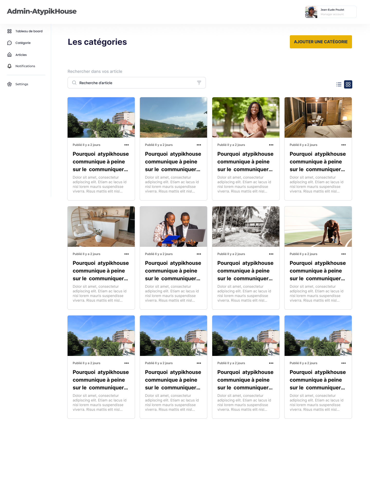
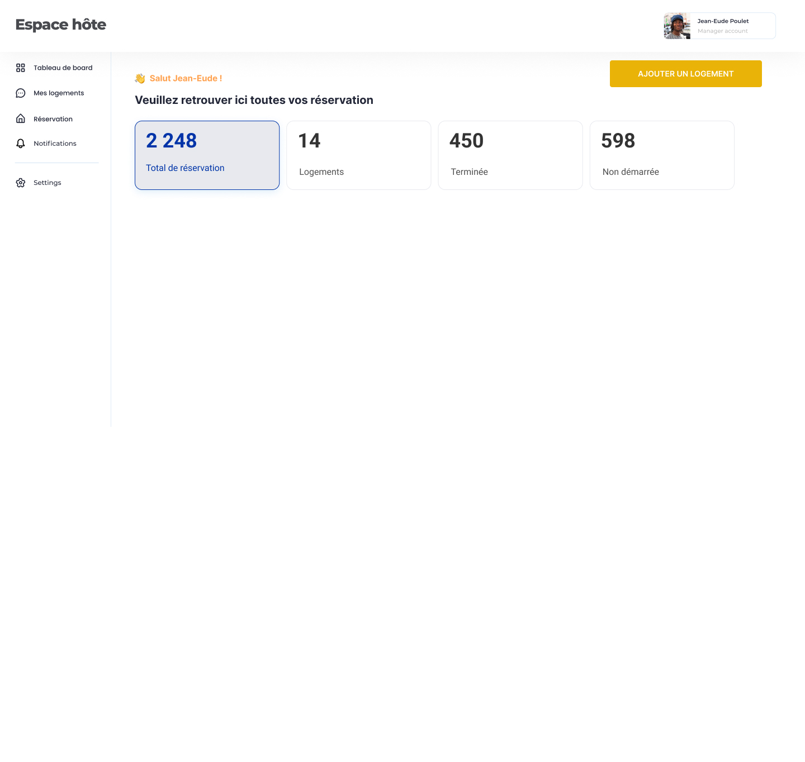

# AtypikHause est une application d'hébergement insolite comme les carbanes dans les arbres, les yourtes ...
# Sur le site le client a la posibiltés de:
- Reservé un logement n'importe oû dans le monde rien que avec son pc
- Suivre ses reservations et avec possibilité d'annuler
- la fonctionnalité "Dévenir hôte" permet à un client de poster son logement sur la plateforme AtypikHouse

# Le site atypikHouse contient aussi une partie admin qui permet au proprietaire d'atypikause de repondre au besoin des clients lorsqu'ils réalisent les activités sur le site


# Catégorie



# Page Blog


# Dachbaod client


# Daschbaord



# mes logements


# Quasar App (atypik)

A Quasar Project

## Install the dependencies
```bash
yarn
# or
npm install
```

### Start the app in development mode (hot-code reloading, error reporting, etc.)
```bash
quasar dev
```


### Lint the files
```bash
yarn lint
# or
npm run lint
```


### Format the files
```bash
yarn format
# or
npm run format
```


### Build the app for production
```bash
quasar build
```

### Customize the configuration
See [Configuring quasar.config.js](https://v2.quasar.dev/quasar-cli-vite/quasar-config-js).
